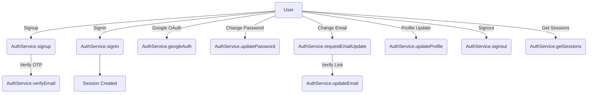

# AuthService Code Analysis

## Overview

The `AuthService` class is a comprehensive authentication and user management service for a Node.js/Express/Mongoose-based application. It provides features for user registration, authentication, session management, profile updates, password/email changes, role-based access control, and more.

---

## 1. Key Features

- **User Authentication Flows**

  - Signup with email verification (OTP).
  - Signin with password validation.
  - Google OAuth integration.
  - JWT-based access and refresh tokens.

- **Session Management**

  - Secure, HTTP-only cookies for tokens.
  - Session storage and validation in both MongoDB and Redis.
  - Session invalidation on password/email changes and signout.

- **Profile and Settings**

  - Profile retrieval and selective updates.
  - Avatar upload with Cloudinary.
  - Address and feedback management.

- **Account Security**

  - Password hashing and validation.
  - Verification for sensitive operations (email/password changes).
  - Role-based access control (`restrictTo` middleware).

- **Admin/User Utilities**
  - Paginated user fetching with query, filter, sort, and field selection.

---

## 2. Security Practices

- **Sensitive Data Handling**

  - Passwords never returned in responses.
  - Sessions protected with signed cookies and HMAC hashing.
  - Sessions and tokens invalidated when credentials are changed.

- **Validation/Verification**

  - OTP for signup and email update.
  - Password validation for password/email change.
  - Role checks for restricted endpoints.

- **Session Storage**

  - Sessions stored in Redis (for fast validation) and MongoDB (for persistence).

- **Email Operations**
  - Secure email operations for verification and updates.

---

## 3. Extensibility

- **Generic User Model**
  - `AuthService<T extends IUser>`: Can be reused for different user schemas.
- **Utilizes Utility Classes**
  - Utility functions (OTP, JWT, encryption) are abstracted for maintainability.
- **Configurable Providers**
  - Swappable providers for Redis, Cloudinary, config, and email.

---

## 4. Code Organization

| Functionality      | Method Name(s)                                                                                      |
| ------------------ | --------------------------------------------------------------------------------------------------- |
| Signup/Auth        | signup, signin, googleAuth                                                                          |
| Token/Session      | createSession, refreshToken, validateToken, requireAuth, signout, signoutSession, signoutAllSession |
| Profile Management | getProfile, updateProfile, getProfileFields, updateSettings                                         |
| Security Updates   | updatePassword, requestEmailUpdate, updateEmail                                                     |
| User Data          | getUsers, updateAddresses, deleteAddresses, updateFeedback, getSessions                             |
| Access Control     | restrictTo                                                                                          |

---

## 5. Best Practices & Recommendations

- **Async Error Handling:** All methods use a catchAsync utility for unified error management.
- **Separation of Concerns:** Service logic is separated from utility functions and configuration.
- **Scalability:** Bulk user operations are paginated and filterable.
- **Security:** Session invalidation, RBAC, token integrity, and consistent validation.

### Potential Improvements

- **Add Rate Limiting:** Protect endpoints like signup and signin.
- **Enhanced Logging:** Integrate more granular logging for security events.
- **Input Validation:** Ensure all inputs are validated (ideally in route middleware).
- **Testing:** Add comprehensive tests for all critical flows.

---

## 6. Data Flows

---

## 7. Security Summary Table

| Feature               | MongoDB | Redis | Cloudinary | Email | Security |
| --------------------- | :-----: | :---: | :--------: | :---: | :------: |
| Signup/Verify         |    ✓    |   -   |     -      |   ✓   |    ✓     |
| Signin/Session        |    ✓    |   ✓   |     -      |   -   |    ✓     |
| Google Auth           |    ✓    |   ✓   |     -      |   -   |    ✓     |
| Password Reset/Change |    ✓    |   ✓   |     -      |   -   |    ✓     |
| Email Update          |    ✓    |   ✓   |     -      |   ✓   |    ✓     |
| Profile Update        |    ✓    |   ✓   |     ✓      |   -   |    ✓     |
| Feedback/Addresses    |    ✓    |   -   |     -      |   -   |    ✓     |
| RBAC                  |    -    |   -   |     -      |   -   |    ✓     |

---

## 8. Conclusion

The `AuthService` class is a robust foundation for authentication and user management in a modern Node.js application. It follows best practices for security, extensibility, and maintainability, and is designed to scale and adapt as requirements evolve.
